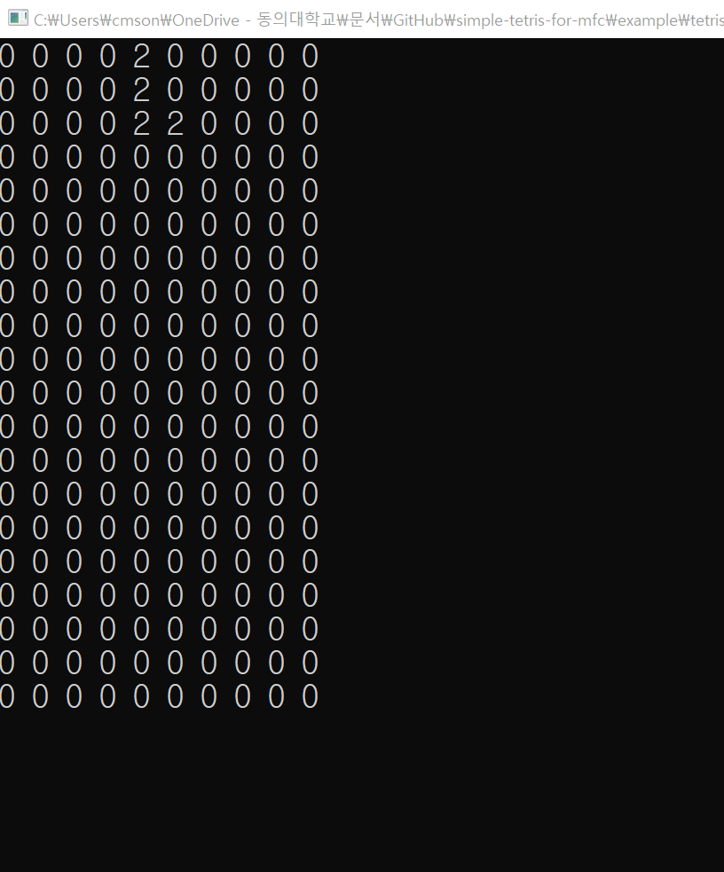

# Tetris-Core를 활용한 Tetris 게임 구현

## 게임 특징

터미널을 활용해 Tetris-Core의 화면을 출력하고, 키보드 입력을 받아 게임을 진행합니다.

- TetrisGame 게임 로직에서 필요한 기능들만 사용할수 있게 구현하였습니다.

## 플레이 방법

- 방향키로 블록을 움직이고, 윗 방향키로 블록을 회전시킬 수 있습니다.

## 모듈 사용 방법

릴리즈에 제공된 헤더파일과 정적 라이브러리 파일을 내려받아 헤더파일 경로와 라이브러리 경로를 지정해주어야 합니다.

### 빌드 방법

_아래 명령어는 Tetris-Core의 프로젝트를 클론했을 경우 사용가능한 명령어입니다._

```powershell
clang++ -std=c++17 -I.. -o tetris_game.exe main.cpp libtetris.a
```

## 실행 결과


